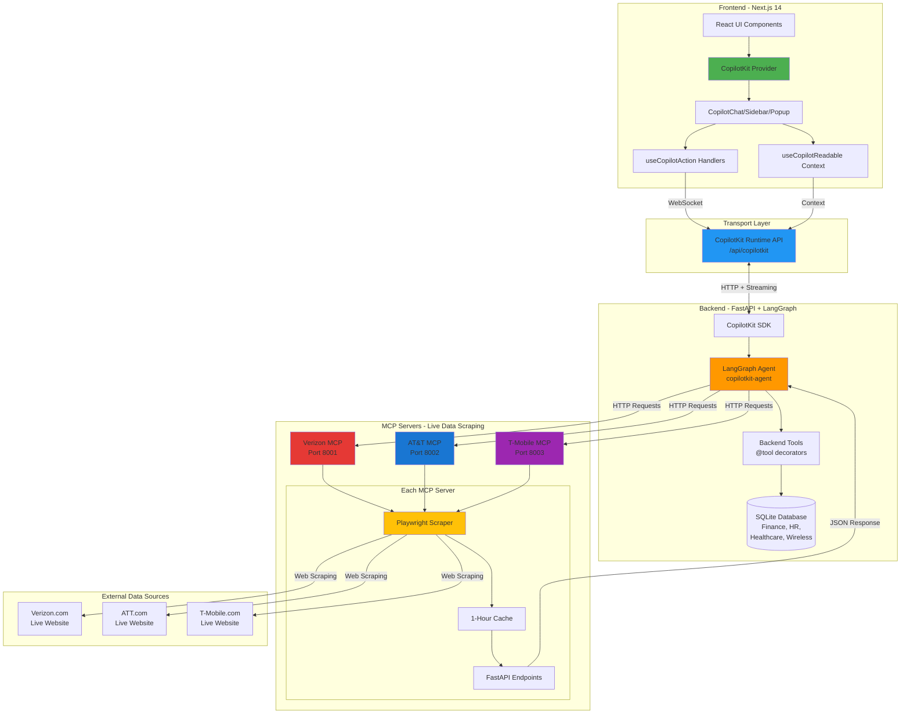
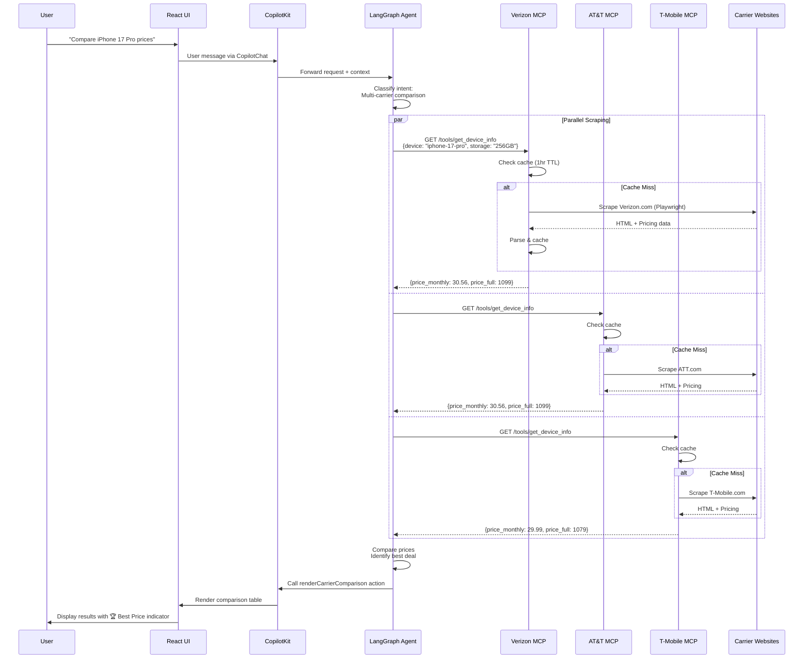
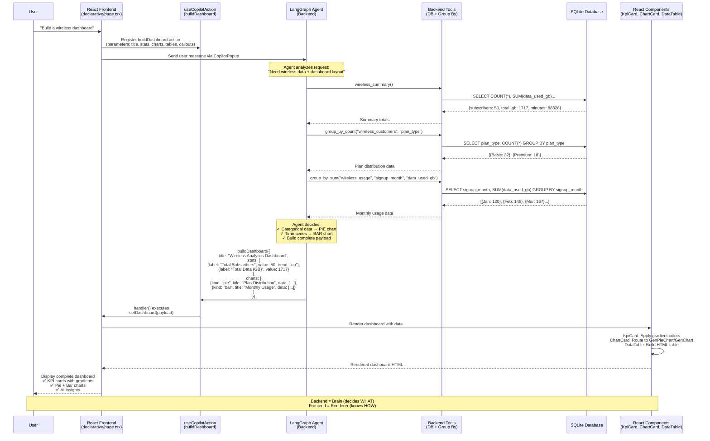
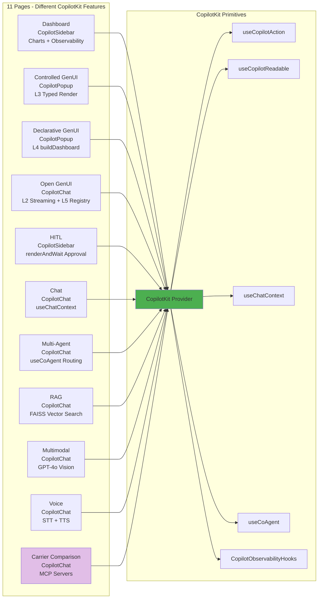
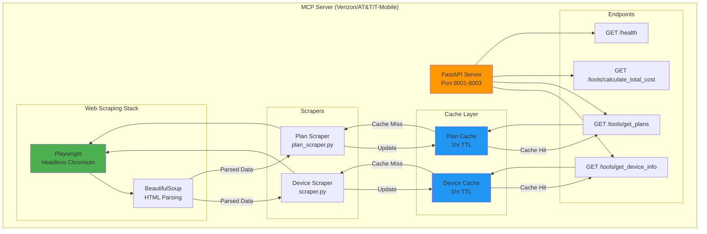

# CopilotKit POC - Architecture Overview

## System Architecture Flow



## Data Flow - Carrier Comparison Example



## Declarative UI Flow (L4) - "Build a Wireless Dashboard"



### Key Concepts - Declarative UI

| Layer | Role | Example |
|-------|------|---------|
| **User** | Describes intent | "Build a wireless dashboard" |
| **Backend Agent** | Decides structure & data | Calls DB tools, chooses chart types ("pie", "bar"), structures payload |
| **useCopilotAction** | Action contract | Defines `buildDashboard(title, stats, charts, tables, callouts)` |
| **Frontend Handler** | State update | `setDashboard(payload)` → triggers React re-render |
| **React Components** | Visual rendering | `<KpiCard>`, `<ChartCard>`, `<DataTable>` render with Tailwind styling |

**Why "Declarative"?**  
The agent **declares** the UI structure (stats array, charts array with `kind` property) without writing React/HTML code. Frontend components know **how** to render any structure the agent provides.

---

## Component Architecture



## MCP Server Architecture - 100% Live Scraping



## Technology Stack

```mermaid
graph LR
    subgraph "Frontend"
        Next[Next.js 14<br/>App Router]
        React[React 18]
        TS[TypeScript]
        Tailwind[Tailwind CSS]
        CKLib[@copilotkit 1.10.5]
    end

    subgraph "Backend"
        FastAPI[FastAPI]
        LangGraph[LangGraph]
        LangChain[LangChain]
        Pydantic[Pydantic]
    end

    subgraph "AI/ML"
        OpenAI[OpenAI GPT-4o]
        FAISS[FAISS Vector DB]
    end

    subgraph "Scraping"
        PW[Playwright]
        BS[BeautifulSoup4]
    end

    subgraph "Data"
        SQLite[SQLite Database]
        Cache[In-Memory Cache]
    end

    Next --> React
    Next --> TS
    Next --> Tailwind
    Next --> CKLib
    
    CKLib --> FastAPI
    FastAPI --> LangGraph
    LangGraph --> LangChain
    LangGraph --> OpenAI
    
    FastAPI --> SQLite
    FastAPI --> FAISS
    
    FastAPI --> PW
    PW --> BS
    
    FastAPI --> Cache
```

## Key Features by Layer

### Frontend Layer
- **10 Demo Pages** - Each showcasing different CopilotKit primitives
- **3 UI Components** - CopilotSidebar, CopilotPopup, CopilotChat
- **67 CopilotKit Features** - 50 implemented, 17 N/A or OSS-only
- **Real-time UI Updates** - Actions trigger instant UI rendering

### Transport Layer
- **CopilotKit Runtime** - WebSocket + HTTP streaming
- **Thread Persistence** - localStorage threadId for session continuity
- **Observability** - 7 lifecycle hooks for monitoring

### Agent Layer
- **5 Specialized Agents** - copilotkit-agent, finance, hr, healthcare, wireless
- **Multi-Agent Routing** - Dynamic agent switching based on intent
- **Tool Orchestration** - 20+ backend tools for data access

### MCP Layer (Model Context Protocol)
- **3 Carrier Servers** - Verizon (8001), AT&T (8002), T-Mobile (8003)
- **100% Live Scraping** - No static data, all from carrier websites
- **Smart Caching** - 1-hour TTL to reduce scraping load
- **Storage-Aware Pricing** - Correct pricing per storage variant

### Data Layer
- **4 Domains** - Finance, HR, Healthcare, Wireless
- **SQLite Database** - 12 tables with realistic mock data
- **FAISS Vector Store** - For RAG document retrieval
- **In-Memory Cache** - Fast device/plan lookup

## Data Flow Summary

1. **User Input** → React UI (CopilotChat/Sidebar/Popup)
2. **Frontend** → CopilotKit Provider (with context + actions)
3. **Transport** → CopilotKit Runtime API (/api/copilotkit)
4. **Backend** → LangGraph Agent (intent classification)
5. **Data Sources**:
   - **Database Tools** → SQLite (Finance, HR, Healthcare, Wireless)
   - **MCP Servers** → Live carrier websites (Verizon, AT&T, T-Mobile)
   - **RAG Tool** → FAISS vector search
6. **Agent** → Calls appropriate tools/MCPs
7. **Response** → Agent calls frontend actions (render UI)
8. **UI Update** → React components render results

## Performance & Caching

- **MCP Cache**: 1-hour TTL per device/plan/storage combo
- **Parallel Scraping**: All 3 carriers scraped simultaneously for comparisons
- **Fallback Strategy**: Minimal hardcoded data ONLY if scraping fails
- **Cache Clearing**: `POST /cache/clear` endpoint on each MCP server

## Security & Best Practices

- **CORS**: Configured for localhost:3000 frontend
- **Rate Limiting**: Playwright headless mode with delays
- **Error Handling**: Graceful fallback for scraping failures
- **Type Safety**: TypeScript + Pydantic for full stack typing
- **No Secrets in Code**: Environment variables for API keys
