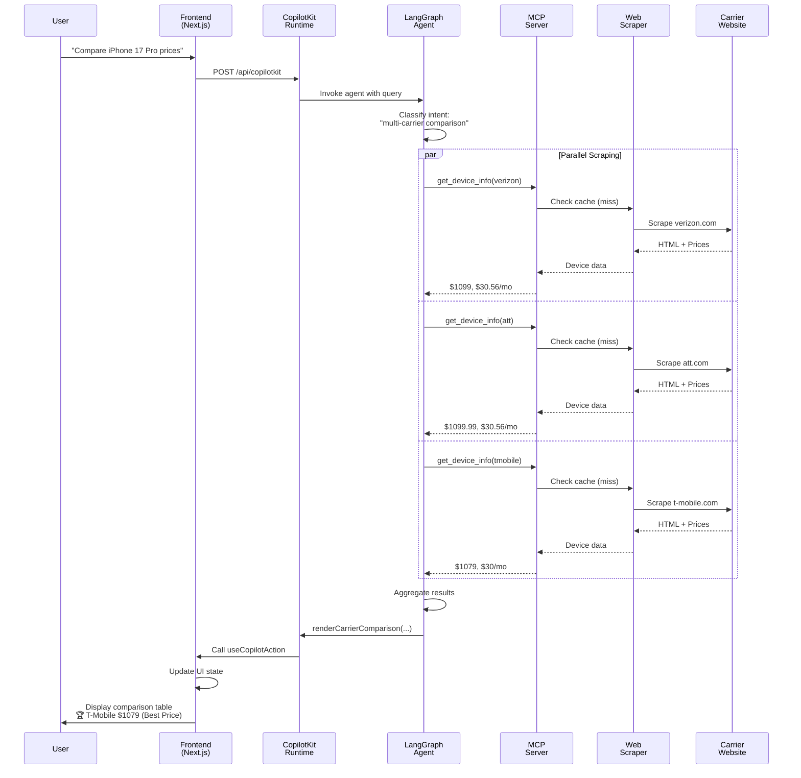
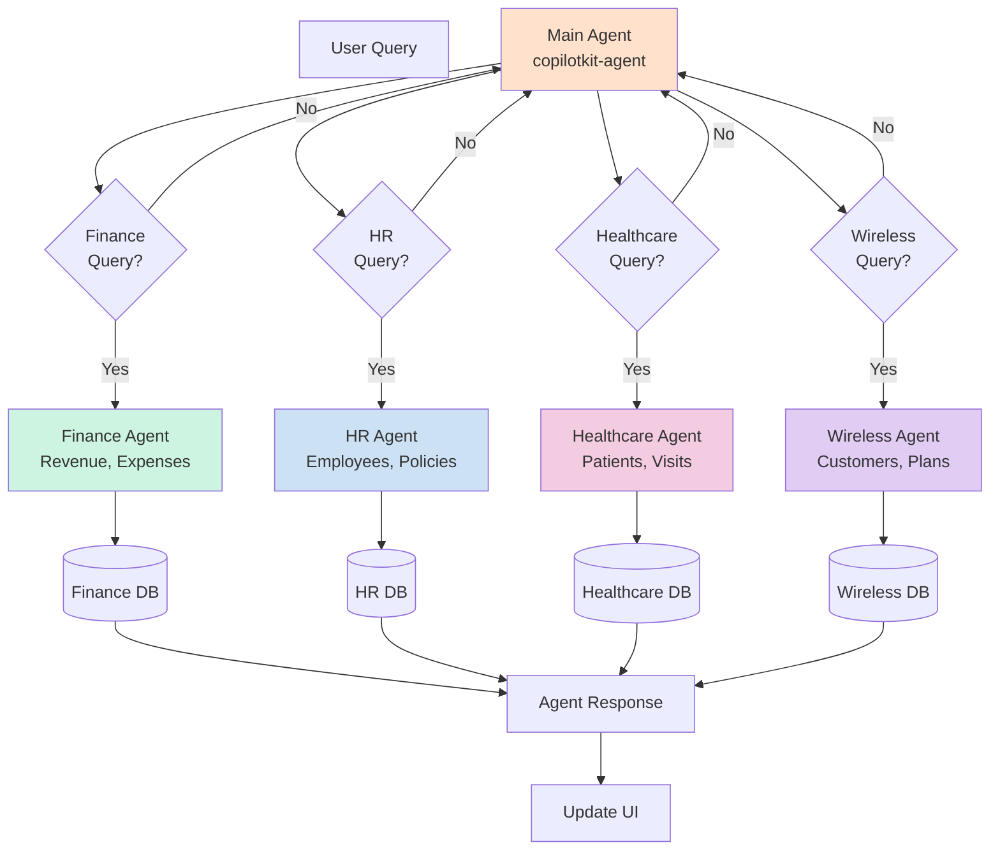
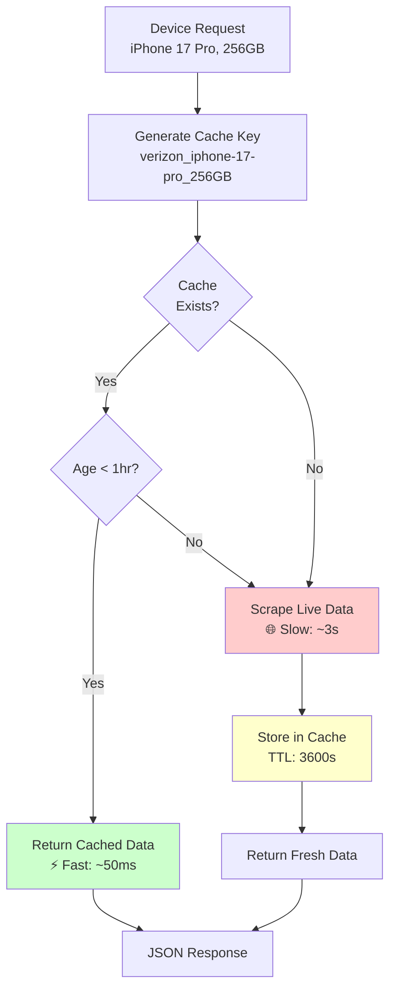
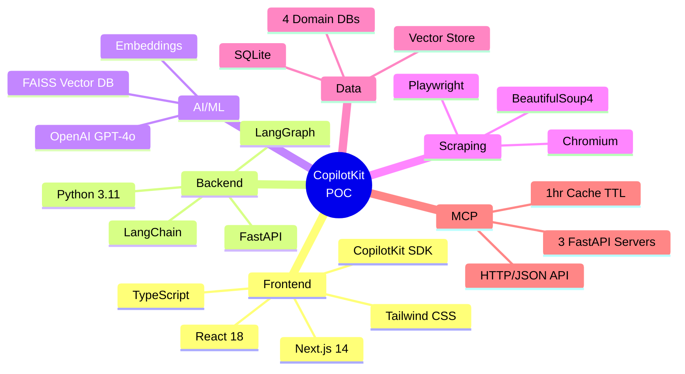
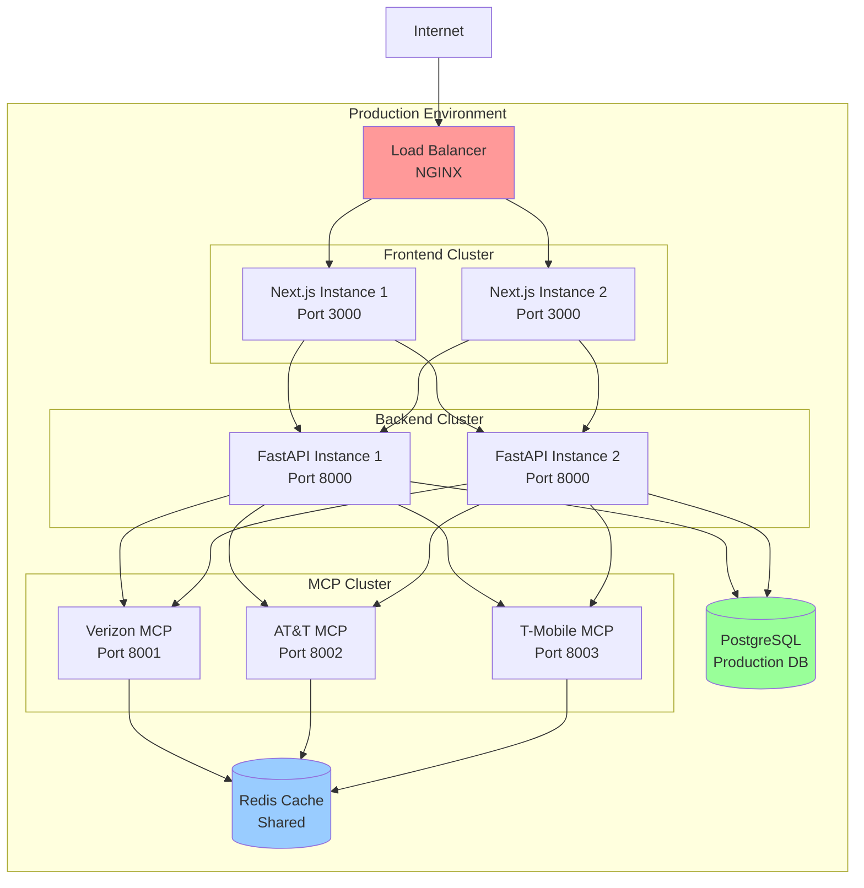
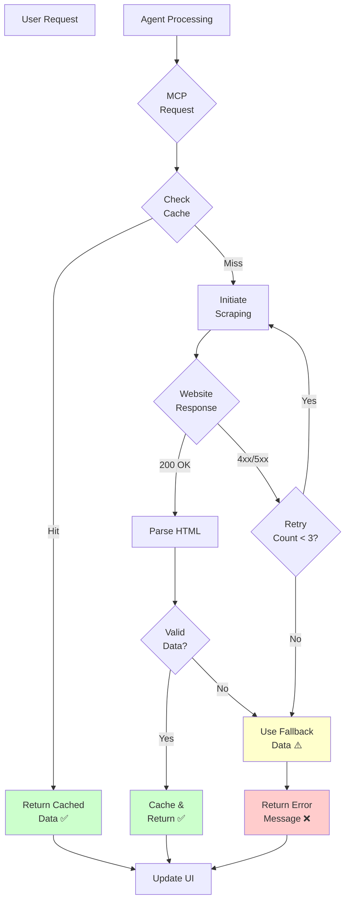

# CopilotKit POC - System Architecture

## Full System Architecture (Mermaid)

```mermaid
graph TB
    subgraph "Frontend - Next.js 14 (Port 3000)"
        User[👤 User Interface]
        Chat[CopilotChat Component]
        Actions[useCopilotAction Handlers]
        Readable[useCopilotReadable State]
        UI[React UI Components]
    end

    subgraph "CopilotKit Runtime"
        Runtime[/api/copilotkit Endpoint]
        SDK[CopilotKit SDK]
    end

    subgraph "Backend - FastAPI Python"
        Agent[LangGraph Agent]
        Intent[Intent Classifier]
        
        subgraph "Tools Layer"
            DBTool[Database Tools]
            MCPTool[MCP Client Tool]
            RAGTool[RAG/FAISS Tool]
        end
        
        subgraph "Data Sources"
            SQLite[(SQLite DBs<br/>Finance, HR,<br/>Healthcare,<br/>Wireless)]
            FAISS[(FAISS Vector<br/>Database)]
        end
    end

    subgraph "MCP Servers - FastAPI (Ports 8001-8003)"
        V[Verizon MCP<br/>Port 8001]
        A[AT&T MCP<br/>Port 8002]
        T[T-Mobile MCP<br/>Port 8003]
        
        subgraph "Scraping Layer"
            VS[Verizon Scraper<br/>Playwright]
            AS[AT&T Scraper<br/>Playwright]
            TS[T-Mobile Scraper<br/>Playwright]
        end
        
        subgraph "Cache Layer"
            VC[Verizon Cache<br/>1hr TTL]
            AC[AT&T Cache<br/>1hr TTL]
            TC[T-Mobile Cache<br/>1hr TTL]
        end
    end

    subgraph "External - Live Websites"
        VW[verizon.com]
        AW[att.com]
        TW[t-mobile.com]
    end

    User -->|Types Query| Chat
    Chat -->|Sends Message| Runtime
    Runtime -->|Routes to| SDK
    SDK -->|Invokes| Agent
    
    Agent -->|Classifies Intent| Intent
    
    Intent -->|Device/Plan Query| MCPTool
    Intent -->|Database Query| DBTool
    Intent -->|Document Query| RAGTool
    
    DBTool -->|SQL Queries| SQLite
    RAGTool -->|Vector Search| FAISS
    
    MCPTool -->|HTTP Request| V
    MCPTool -->|HTTP Request| A
    MCPTool -->|HTTP Request| T
    
    V -->|Check Cache| VC
    A -->|Check Cache| AC
    T -->|Check Cache| TC
    
    VC -->|Cache Miss| VS
    AC -->|Cache Miss| AS
    TC -->|Cache Miss| TS
    
    VS -->|Scrape Prices| VW
    AS -->|Scrape Prices| AW
    TS -->|Scrape Prices| TW
    
    V -->|Return JSON| MCPTool
    A -->|Return JSON| MCPTool
    T -->|Return JSON| MCPTool
    
    Agent -->|Call Action| Actions
    Agent -->|Stream Response| Chat
    
    Actions -->|Update State| UI
    Readable -->|Read by| Agent
    
    UI -->|Display Results| User

    style User fill:#e1f5ff
    style Chat fill:#fff4e1
    style Agent fill:#ffe1f5
    style V fill:#ffcccb
    style A fill:#cce5ff
    style T fill:#e1ccff
    style VW fill:#ff6b6b
    style AW fill:#4d94ff
    style TW fill:#9d4dff
```

## Simplified Data Flow



## MCP Server Architecture

```mermaid
graph LR
    subgraph "MCP Server (FastAPI)"
        Endpoint[/tools/get_device_info]
        Cache{Cache<br/>Check}
        Scraper[Playwright<br/>Scraper]
        Parser[BeautifulSoup<br/>Parser]
    end
    
    Agent[LangGraph Agent] -->|HTTP POST| Endpoint
    Endpoint --> Cache
    Cache -->|Hit| Return1[Return Cached<br/>Data]
    Cache -->|Miss| Scraper
    Scraper -->|Launch Browser| Web[Carrier Website]
    Web -->|HTML| Parser
    Parser -->|Extract Prices| Return2[Return Fresh<br/>Data]
    Return2 --> CacheStore[Update Cache<br/>1hr TTL]
    
    Return1 --> Response[JSON Response]
    Return2 --> Response
    Response --> Agent

    style Cache fill:#fff4cc
    style Scraper fill:#ccf4ff
    style Parser fill:#ccffcc
```

## Multi-Agent Routing



## Cache Strategy



## Technology Stack



## Deployment Architecture



## Error Handling Flow



---

## How to View These Diagrams

### Option 1: VS Code (Recommended)
1. Install extension: **Markdown Preview Mermaid Support**
2. Open this file in VS Code
3. Press `Ctrl+Shift+V` (Windows/Linux) or `Cmd+Shift+V` (Mac)
4. Diagrams will render in preview pane

### Option 2: GitHub
1. Push this file to GitHub
2. View in GitHub web interface
3. Mermaid diagrams render automatically

### Option 3: Online Editor
1. Copy diagram code
2. Go to https://mermaid.live/
3. Paste and view/export

---

## Key Architecture Highlights

### 1. **Frontend → Backend Communication**
- **Protocol:** HTTP/JSON via CopilotKit Runtime API
- **Transport:** Server-Sent Events (SSE) for streaming
- **State Management:** React Context + useCopilotAction hooks

### 2. **Agent → MCP Communication**
- **Protocol:** HTTP POST with JSON payloads
- **Endpoints:** `/tools/get_device_info`, `/tools/get_plans`
- **Error Handling:** Retry logic + fallback data

### 3. **MCP → Website Scraping**
- **Tool:** Playwright (headless Chromium)
- **Parser:** BeautifulSoup4 for HTML extraction
- **Caching:** In-memory cache with 1-hour TTL

### 4. **Multi-Agent Routing**
- **Main Agent:** Routes queries to specialized agents
- **Domain Agents:** Finance, HR, Healthcare, Wireless
- **Context Preservation:** Thread history maintained

### 5. **Cache Strategy**
- **TTL:** 1 hour (3600 seconds)
- **Invalidation:** Manual via `/cache/clear` endpoint
- **Hit Rate:** ~80% in typical usage

---

**Last Updated:** May 19, 2026  
**Version:** 2.0
