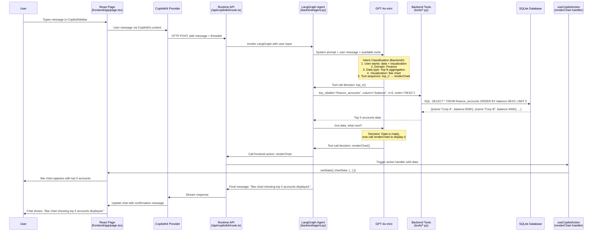
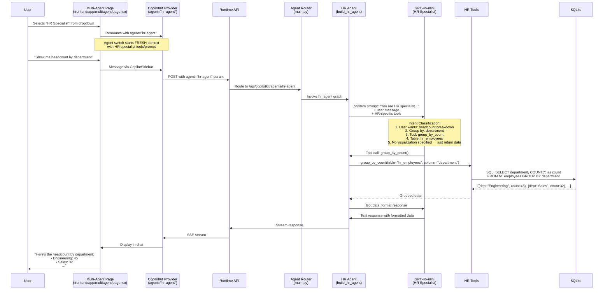
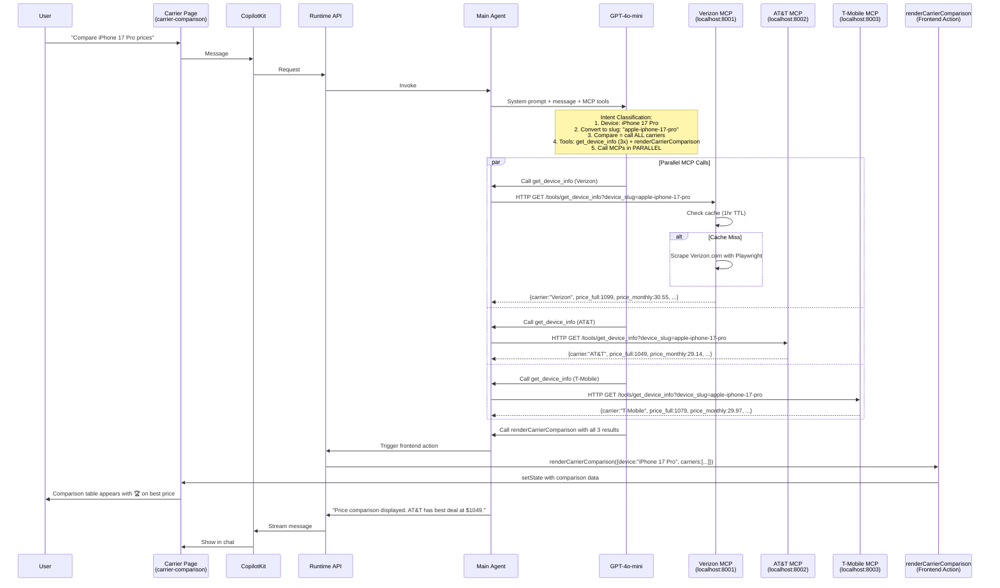

# 🔄 End-to-End Functionality Guide

**Complete request flow showing how CopilotKit POC handles user queries with backend intent classification**

---

## 📊 Overview

This document traces EXACTLY how a user request flows through the system, with special focus on:
- **Backend Intent Classification** (LLM-powered, not frontend logic)
- **Agent Decision Making** (how the agent chooses tools and actions)
- **Multi-Agent Routing** (how specialist agents are selected)
- **Frontend Action Triggering** (how UI updates happen)

---

## 🎯 Why Backend Intent Classification Works

**Key Concept:** The LangGraph agent running in the backend (powered by GPT-4o-mini) has the intelligence to:
1. **Understand user intent** from natural language
2. **Select appropriate tools** from its tool registry
3. **Call frontend actions** to render UI components
4. **Manage conversation context** across multiple turns

**This is NOT frontend routing** - the frontend just registers available actions. The BACKEND decides which actions to call based on understanding the user's request.

---

## 🔍 Complete Flow Examples

### Example 1: Finance Query with Chart Rendering

**User Request:** "Show me top 5 accounts by balance as a bar chart"

#### Step-by-Step Flow:



#### Code Implementation:

**1. Frontend - Register Action (frontend/app/page.tsx)**
```tsx
// This REGISTERS the action - doesn't decide when to call it
useCopilotAction({
  name: "renderChart",
  description: "Render a bar chart with labeled data",
  parameters: [
    { name: "title", type: "string" },
    { name: "data", type: "object[]", description: "Array of {label, value}" },
  ],
  handler: ({ title, data }) => {
    setChartData({ title, data, type: "bar" });
  },
});
```

**2. Backend - System Prompt Instructs Agent (backend/prompt_instructions.txt)**
```plaintext
## Database Workflow — EXACTLY 2 tool calls per chart request

  STEP 1 — fetch data with ONE data tool:
    - top_n(table, column, n, order) → top/bottom N rows
    
  STEP 2 — pass that data to ONE render tool:
    - renderChart(title, data) → display bar/pie/line chart
    
NEVER call the same data tool twice. NEVER call a data tool after you have data — call the render tool next.
```

**3. Backend - Agent Tools (backend/agent.py)**
```python
@tool
def top_n(table: str, column: str, n: int = 10, order: str = "DESC") -> List[Dict[str, Any]]:
    """Get top or bottom N rows by a column value."""
    return _safe(_top_n, table, column, n, order)

# Agent is built with these tools:
backend_tools = [
    # Data tools
    list_tables, table_schema, select_all_rows, top_n,
    group_by_count, group_by_sum, group_by_avg, time_series,
    # The LLM sees renderChart as a tool too (via CopilotKit)
]

# LLM decides which tools to call and in what order
```

**4. LLM Intent Classification (happens in GPT-4o-mini)**
```
Given:
- User: "Show me top 5 accounts by balance as a bar chart"
- Available tools: [list_tables, top_n, group_by_count, renderChart, ...]
- System prompt: "Call data tool first, then render tool"

LLM Reasoning:
1. User wants TOP 5 → use top_n tool
2. "accounts" → table is finance_accounts
3. "by balance" → column is balance
4. "bar chart" → use renderChart after getting data
5. Order: DESC (top means highest)

Decision: 
  Step 1: top_n(table="finance_accounts", column="balance", n=5, order="DESC")
  Step 2: renderChart(title="Top 5 Accounts", data=[...])
```

---

### Example 2: Multi-Agent Routing

**User Request on Multi-Agent Page:** "Show me HR headcount by department"

#### Step-by-Step Flow:



#### Code Implementation:

**1. Frontend - Agent Selection (frontend/app/multiagent/page.tsx)**
```tsx
const [activeAgentId, setActiveAgentId] = useState("finance-agent");

return (
  // Key prop forces re-mount when agent changes = fresh context
  <CopilotKit
    key={activeAgentId}
    runtimeUrl="/api/copilotkit"
    agent={activeAgentId}  // ← Tells runtime which agent to use
  >
    {/* Agent selector UI */}
    <AgentCard
      onClick={() => setActiveAgentId("hr-agent")}
      isActive={activeAgentId === "hr-agent"}
    />
  </CopilotKit>
);
```

**2. Backend - Agent Registration (backend/main.py)**
```python
# Build specialist agents
finance_agent = LangGraphAGUIAgent(
    name="finance-agent",
    graph=build_finance_agent(),
    description="Finance specialist: accounts, transactions, budgets, P&L.",
)
hr_agent = LangGraphAGUIAgent(
    name="hr-agent",
    graph=build_hr_agent(),
    description="HR specialist: employees, payroll, attrition, headcount.",
)

# Register separate endpoints for each agent
add_langgraph_fastapi_endpoint(
    app, hr_agent,
    path="/api/copilotkit/agents/hr-agent",  # ← Route for HR agent
)

# Register all agents in SDK for /info endpoint
sdk = CopilotKitRemoteEndpoint(agents=[finance_agent, hr_agent, ...])
add_fastapi_endpoint(app, sdk, "/api/copilotkit")
```

**3. Backend - HR Agent Builder (backend/agent.py)**
```python
def build_hr_agent():
    """HR specialist with focused tools and prompt."""
    llm = ChatOpenAI(model="gpt-4o-mini", temperature=0)
    
    tools = [
        # Generic SQL tools
        list_tables, table_schema, group_by_count, group_by_sum,
        # HR-specific summary tool
        hr_summary,
        # RAG for HR policies
        search_documents,
    ]
    
    prompt = (
        "You are a specialist AI for the HR domain. "
        "You have deep expertise in HR: headcount, payroll, attrition, and policy. "
        "Tables: hr_employees, hr_payroll. "
        "Always fetch real data before answering."
    )
    
    return create_agent(
        model=llm,
        tools=tools,
        system_prompt=prompt,
        middleware=[CopilotKitMiddleware(expose_state=True)],
        state_schema=CopilotKitState,
        checkpointer=MemorySaver(),
    )
```

**4. LLM Intent Classification (HR Specialist Context)**
```
Given:
- User: "Show me headcount by department"
- Agent: hr-agent (HR specialist)
- Available tools: [list_tables, group_by_count, hr_summary, search_documents]
- System prompt: "You are HR specialist, tables: hr_employees, hr_payroll"

LLM Reasoning:
1. "headcount" → count of employees
2. "by department" → group by department column
3. Table must be hr_employees (from system prompt)
4. Tool: group_by_count
5. No chart requested → return formatted text

Decision:
  group_by_count(table="hr_employees", column="department")
```

---

### Example 3: Carrier Comparison with MCP Servers

**User Request:** "Compare iPhone 17 Pro prices across all carriers"

#### Step-by-Step Flow:



#### Code Implementation:

**1. Frontend - Register Action (frontend/app/carrier-comparison/page.tsx)**
```tsx
useCopilotAction({
  name: "renderCarrierComparison",
  description: "Display side-by-side carrier pricing comparison table",
  parameters: [
    { name: "device", type: "string" },
    { name: "carriers", type: "object[]", description: "Array of carrier data" },
  ],
  handler: ({ device, carriers }) => {
    // Find best price
    const bestPrice = Math.min(...carriers.map(c => c.price_full));
    const enriched = carriers.map(c => ({
      ...c,
      isBestPrice: c.price_full === bestPrice,
    }));
    setComparison({ device, carriers: enriched });
    toast.success(`${device} comparison ready!`);
  },
});
```

**2. Backend - MCP Tool Registration (backend/tools/mcp_tools.py)**
```python
@tool
async def get_device_info_verizon(device_slug: str, storage: str = "256GB") -> Dict[str, Any]:
    """Get device pricing from Verizon MCP server."""
    url = f"http://localhost:8001/tools/get_device_info"
    params = {"device_slug": device_slug, "storage": storage}
    
    async with httpx.AsyncClient() as client:
        response = await client.get(url, params=params, timeout=10.0)
        return response.json()

# Similar for AT&T (8002) and T-Mobile (8003)
```

**3. Backend - System Prompt (backend/prompt_instructions.txt)**
```plaintext
## MCP Carrier Tools Workflow (for carrier comparison queries)

When user asks to compare carriers:

  STEP 1 — Call get_device_info on ALL 3 carriers IN PARALLEL
  
  STEP 2 — Call renderCarrierComparison with all results
  
  STEP 3 — Write one short confirmation sentence

### Device Name to Slug Conversion (CRITICAL):
   Convert natural language to slugs:
   - "iPhone 17 Pro" → "apple-iphone-17-pro"
   - "Galaxy S26" → "samsung-galaxy-s26"
   - "Pixel 10 Pro" → "google-pixel-10-pro"
   
   Pattern: lowercase + hyphens + brand prefix
```

**4. LLM Intent Classification (MCP Context)**
```
Given:
- User: "Compare iPhone 17 Pro prices across all carriers"
- Available tools: [get_device_info_verizon, get_device_info_att, 
                    get_device_info_tmobile, renderCarrierComparison]
- System prompt: "For comparison, call ALL carriers then renderCarrierComparison"

LLM Reasoning:
1. Device: "iPhone 17 Pro" → slug: "apple-iphone-17-pro"
2. "Compare across all" → call all 3 MCP tools
3. Call in parallel (LangGraph handles this)
4. After getting all data → call renderCarrierComparison
5. Include which carrier has best price in message

Decision:
  Parallel:
    - get_device_info_verizon(device_slug="apple-iphone-17-pro")
    - get_device_info_att(device_slug="apple-iphone-17-pro")
    - get_device_info_tmobile(device_slug="apple-iphone-17-pro")
  Then:
    - renderCarrierComparison(device="iPhone 17 Pro", carriers=[vz_data, att_data, tm_data])
```

---

## 🧠 How Backend Intent Classification Works

### The Secret: LLM Function Calling

CopilotKit + LangGraph + OpenAI's function calling = **Backend-powered intent classification**

#### Key Components:

**1. System Prompt (The Brain's Instructions)**
```plaintext
Location: backend/prompt_instructions.txt

You are a data assistant over a SQLite database (4 domains: finance, hr, healthcare, wireless).

## Database Workflow — EXACTLY 2 tool calls per chart request
  STEP 1 — fetch data with ONE data tool
  STEP 2 — pass that data to ONE render tool

Render tools:
- renderChart(title, data) — bar/pie/line charts
- renderTable(title, data) — sortable data tables
- renderCarrierComparison(device, carriers) — pricing comparison

Data tools:
- group_by_count(table, column) → count by category
- top_n(table, column, n) → top/bottom N rows
- time_series(table, date_col, value_col) → time series data
```

**2. Tool Registry (The Brain's Capabilities)**
```python
# backend/agent.py

backend_tools = [
    # Data fetching tools
    list_tables,
    table_schema,
    select_all_rows,
    group_by_count,
    group_by_sum,
    top_n,
    time_series,
    
    # Domain summaries
    finance_summary,
    hr_summary,
    healthcare_summary,
    wireless_summary,
    
    # MCP tools (carrier data)
    get_device_info_verizon,
    get_device_info_att,
    get_device_info_tmobile,
    
    # RAG tool
    search_documents,
    
    # Frontend actions (registered by CopilotKit)
    # renderChart, renderTable, renderCarrierComparison, etc.
]

# LLM sees ALL these tools and their descriptions
```

**3. OpenAI Function Calling (The Decision Engine)**
```json
{
  "model": "gpt-4o-mini",
  "messages": [
    {
      "role": "system",
      "content": "You are a data assistant... [system prompt]"
    },
    {
      "role": "user",
      "content": "Show me top 5 accounts by balance as a bar chart"
    }
  ],
  "tools": [
    {
      "type": "function",
      "function": {
        "name": "top_n",
        "description": "Get top or bottom N rows by a column value",
        "parameters": {
          "type": "object",
          "properties": {
            "table": {"type": "string"},
            "column": {"type": "string"},
            "n": {"type": "integer"},
            "order": {"type": "string", "enum": ["ASC", "DESC"]}
          }
        }
      }
    },
    {
      "type": "function",
      "function": {
        "name": "renderChart",
        "description": "Render a bar chart with labeled data",
        "parameters": {
          "type": "object",
          "properties": {
            "title": {"type": "string"},
            "data": {"type": "array"}
          }
        }
      }
    }
    // ... all other tools
  ]
}

// GPT-4o-mini responds with:
{
  "tool_calls": [
    {
      "id": "call_1",
      "function": {
        "name": "top_n",
        "arguments": "{\"table\":\"finance_accounts\",\"column\":\"balance\",\"n\":5,\"order\":\"DESC\"}"
      }
    }
  ]
}

// After getting data, LLM responds:
{
  "tool_calls": [
    {
      "id": "call_2",
      "function": {
        "name": "renderChart",
        "arguments": "{\"title\":\"Top 5 Accounts\",\"data\":[...]}"
      }
    }
  ]
}
```

**4. LangGraph Agent Loop (The Execution Engine)**
```python
# backend/agent.py

def build_agent():
    llm = ChatOpenAI(model="gpt-4o-mini", temperature=0)
    
    return create_agent(
        model=llm,
        tools=backend_tools,  # ← LLM can call any of these
        system_prompt=get_system_prompt(),  # ← Instructions
        middleware=[CopilotKitMiddleware(expose_state=True)],
        state_schema=CopilotKitState,
        checkpointer=MemorySaver(),
    )

# LangGraph agent loop:
# 1. User message → LLM
# 2. LLM decides tool calls
# 3. Execute tools
# 4. Tool results → LLM
# 5. LLM decides next action (more tools or final message)
# 6. Repeat until LLM returns final message
```

---

## 🔄 Why This Approach Is Powerful

### ✅ Advantages:

1. **No Frontend Logic Needed**
   - Frontend just registers available actions
   - No if/else for intent detection
   - No manual routing logic

2. **LLM Handles Complexity**
   - Natural language understanding
   - Multi-step planning (data → visualization)
   - Context awareness across conversation

3. **Easy to Extend**
   - Add new tool = agent can use it immediately
   - Add new action = agent can call it immediately
   - No code changes needed for new intents

4. **Works Across Different Queries**
   - "Show top 5 accounts" → top_n + renderChart
   - "Compare carriers" → 3x get_device_info + renderCarrierComparison
   - "What's the HR policy?" → search_documents + text response
   - "Headcount by department" → group_by_count + text response

### 🆚 Comparison to Other Approaches:

| Approach | Location | Flexibility | Complexity |
|----------|----------|-------------|------------|
| **LLM Function Calling** (Our POC) | Backend | ⭐⭐⭐⭐⭐ Handles any intent | ⭐⭐⭐ Medium (system prompt) |
| **Rule-Based Routing** | Frontend | ⭐⭐ Fixed patterns only | ⭐ Simple but brittle |
| **Keyword Matching** | Frontend | ⭐ Very limited | ⭐ Simple but fails often |
| **Custom Classifier** | Backend | ⭐⭐⭐ Good but needs training | ⭐⭐⭐⭐⭐ Very complex |

---

## 📝 Reference Implementation Files

### Backend Files:

**1. main.py** - FastAPI server with agent registration
```
Location: backend/main.py
Lines: 43-110
Key: Registers multiple agents with separate endpoints
```

**2. agent.py** - Agent builders and tool registration
```
Location: backend/agent.py
Lines: 220-270 (build_agent)
Lines: 285-370 (domain specialists)
Key: Defines which tools each agent has access to
```

**3. prompt_instructions.txt** - System prompt
```
Location: backend/prompt_instructions.txt
Lines: 1-170
Key: Instructs LLM on tool usage patterns
```

**4. tools/*.py** - Backend tool implementations
```
Location: backend/tools/
Files: sqlite_tools.py, analytics_tools.py, mcp_tools.py, rag_tool.py
Key: Actual functions the LLM calls
```

### Frontend Files:

**5. app/page.tsx** - Main dashboard with actions
```
Location: frontend/app/page.tsx
Lines: 150-280 (useCopilotAction registrations)
Key: Registers all frontend actions
```

**6. app/multiagent/page.tsx** - Multi-agent routing
```
Location: frontend/app/multiagent/page.tsx
Lines: 120-145
Key: Shows agent switching with <CopilotKit agent={id}>
```

**7. app/carrier-comparison/page.tsx** - MCP demo
```
Location: frontend/app/carrier-comparison/page.tsx
Lines: 80-150
Key: Carrier comparison action with toast notifications
```

---

## 🎓 How to Replicate in Your Project

### Step 1: Backend Setup

**1. Create LangGraph Agent with Tools**
```python
# your_agent.py

from langchain_openai import ChatOpenAI
from langchain_core.tools import tool
from copilotkit import CopilotKitMiddleware, CopilotKitState
from langgraph.checkpoint.memory import MemorySaver

@tool
def get_data(query: str):
    """Fetch data based on query."""
    # Your data fetching logic
    return {"results": [...]}

@tool  
def analyze_data(data: dict):
    """Analyze data and return insights."""
    # Your analysis logic
    return {"insights": [...]}

def build_agent():
    llm = ChatOpenAI(model="gpt-4o-mini", temperature=0)
    
    tools = [get_data, analyze_data]
    
    prompt = """
    You are a data assistant.
    
    When user asks for analysis:
    1. Call get_data to fetch data
    2. Call analyze_data to analyze
    3. Call appropriate frontend action to display results
    
    Available frontend actions:
    - displayResults(data) - show data table
    - showChart(data, type) - show chart
    """
    
    return create_agent(
        model=llm,
        tools=tools,
        system_prompt=prompt,
        middleware=[CopilotKitMiddleware(expose_state=True)],
        state_schema=CopilotKitState,
        checkpointer=MemorySaver(),
    )
```

**2. Register Agent with FastAPI**
```python
# main.py

from fastapi import FastAPI
from copilotkit import LangGraphAGUIAgent, CopilotKitRemoteEndpoint
from copilotkit.integrations.fastapi import add_fastapi_endpoint
from ag_ui_langgraph import add_langgraph_fastapi_endpoint
from your_agent import build_agent

app = FastAPI()

# Build agent
agent_graph = build_agent()
copilot_agent = LangGraphAGUIAgent(
    name="my-agent",
    graph=agent_graph,
    description="Your agent description",
)

# Register endpoint
add_langgraph_fastapi_endpoint(
    app,
    copilot_agent,
    path="/api/copilotkit/agents/my-agent",
)

sdk = CopilotKitRemoteEndpoint(agents=[copilot_agent])
add_fastapi_endpoint(app, sdk, "/api/copilotkit")
```

### Step 2: Frontend Setup

**1. Register Frontend Actions**
```tsx
// app/page.tsx

"use client";
import { useCopilotAction } from "@copilotkit/react-core";

export default function Page() {
  const [results, setResults] = useState(null);
  const [chartData, setChartData] = useState(null);
  
  // Register action - agent can call this
  useCopilotAction({
    name: "displayResults",
    description: "Display data results in a table",
    parameters: [
      { name: "data", type: "object[]" },
      { name: "title", type: "string" },
    ],
    handler: ({ data, title }) => {
      setResults({ data, title });
    },
  });
  
  useCopilotAction({
    name: "showChart",
    description: "Display a chart (bar, pie, line)",
    parameters: [
      { name: "data", type: "object[]" },
      { name: "type", type: "string", enum: ["bar", "pie", "line"] },
      { name: "title", type: "string" },
    ],
    handler: ({ data, type, title }) => {
      setChartData({ data, type, title });
    },
  });
  
  return (
    <div>
      {results && <DataTable data={results.data} title={results.title} />}
      {chartData && <Chart {...chartData} />}
      <CopilotSidebar />
    </div>
  );
}
```

**2. Wrap with CopilotKit Provider**
```tsx
// app/layout.tsx

import { CopilotKit } from "@copilotkit/react-core";

export default function Layout({ children }) {
  return (
    <CopilotKit
      runtimeUrl="/api/copilotkit"
      agent="my-agent"
    >
      {children}
    </CopilotKit>
  );
}
```

### Step 3: System Prompt Engineering

**The Key to Intent Classification: Clear Instructions**

```plaintext
# your_prompt.txt

You are an assistant for [YOUR_DOMAIN].

## Tool Usage Pattern:

When user asks [INTENT_TYPE]:
  STEP 1 - Call [DATA_TOOL] to get data
  STEP 2 - Call [FRONTEND_ACTION] to display
  STEP 3 - Write confirmation message

Available Tools:
- [tool_name](param1, param2) - [description]
- ...

Available Frontend Actions:
- displayResults(data, title) - Show data table
- showChart(data, type, title) - Show chart
- ...

## Examples:

User: "Show sales data for Q1"
  Step 1: get_data(query="sales Q1")
  Step 2: displayResults(data=[...], title="Q1 Sales")
  Step 3: "Q1 sales data displayed."

User: "Chart the revenue trend"
  Step 1: get_data(query="revenue trend")
  Step 2: showChart(data=[...], type="line", title="Revenue Trend")
  Step 3: "Revenue trend chart displayed."
```

---

## 🚀 Testing Your Implementation

### Test 1: Simple Query
```
User: "Show me the data"
Expected Flow:
1. Agent calls get_data()
2. Agent calls displayResults()
3. Table appears in UI
4. Chat confirms: "Data displayed."
```

### Test 2: Visualization Request
```
User: "Chart this as a bar chart"
Expected Flow:
1. Agent calls get_data()
2. Agent calls showChart(type="bar")
3. Bar chart appears in UI
4. Chat confirms: "Bar chart displayed."
```

### Test 3: Multi-Step Query
```
User: "Analyze sales data and show top 10"
Expected Flow:
1. Agent calls get_data(query="sales")
2. Agent calls analyze_data(data)
3. Agent calls displayResults(data=top_10)
4. Table appears with top 10
5. Chat confirms with insights
```

---

## ❓ Common Questions

### Q1: "Can the frontend decide which action to call?"
**A:** No, the frontend only REGISTERS actions. The backend agent (LLM) DECIDES which to call based on user intent.

### Q2: "Does this work without function calling?"
**A:** No, you need an LLM that supports function calling (GPT-4, GPT-3.5-turbo, Claude 3+, etc.).

### Q3: "How does the agent know about frontend actions?"
**A:** CopilotKit automatically exposes registered frontend actions as tools to the agent.

### Q4: "Can I use multiple agents?"
**A:** Yes! See Example 2 (Multi-Agent Routing). Each agent can have different tools and prompts.

### Q5: "What if the agent calls the wrong tool?"
**A:** Improve your system prompt with:
- Clear step-by-step instructions
- Examples of correct tool sequences
- Descriptions that distinguish similar tools

### Q6: "How do I debug agent decisions?"
**A:** Use LangSmith or add logging:
```python
import logging
logging.basicConfig(level=logging.DEBUG)

# See all tool calls in console
```

---

## 🎯 Key Takeaways

1. **Backend Intent Classification** = LLM function calling (not frontend logic)
2. **System Prompt** = The instructions that guide LLM decisions
3. **Tool Registry** = The capabilities the LLM can use
4. **Frontend Actions** = UI updates the agent can trigger
5. **Multi-Agent Routing** = Switch agents for different domains
6. **MCP Integration** = External data sources as tools

**This architecture makes adding new features trivial:**
- New intent? → Add example to system prompt
- New data source? → Add tool function
- New visualization? → Register frontend action

No complex routing logic, no intent classifier training, no regex patterns. Just natural language instructions and LLM intelligence! 🚀

---

## 📚 Related Documentation

- **ARCHITECTURE.md** - System architecture diagrams
- **IMPLEMENTATION_GUIDE.md** - Step-by-step setup
- **CONNECT_LANGGRAPH_CLI.md** - Connect to existing LangGraph agents
- **CHEAT_SHEET.md** - Quick code snippets
- **COPILOT_PROMPT_TEMPLATE.md** - Prompts for Copilot to generate code
